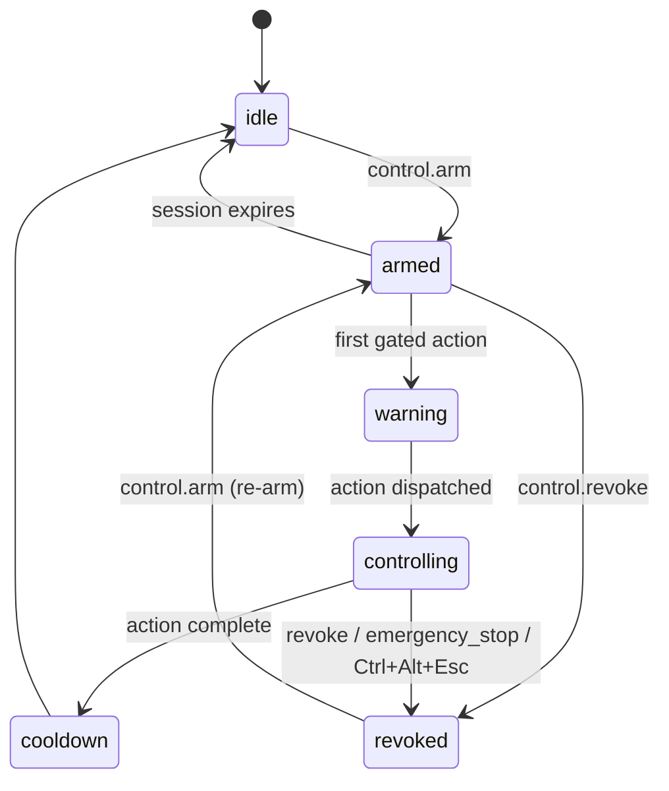

# control.state

[Back to tool index](INDEX.md)

Agent name: `winctl-mcp`

Description: Return desktop-control gate state, active target identity, consent decision, recent in-memory control events, and recent durable audit-log entries.

## Inputs

None.

## Notes

Use this from dashboards, tray controllers, or test harnesses to inspect whether control is idle, armed, active, blocked, or revoked.

The gate moves through these states:

The `control.audit_log` object reports the append-only JSONL audit log path, recent persisted entries, and the last write/read error if the durable log could not be written or read. Audit writes are fail-open: a logging failure is reported here but does not block a consent decision or control action.
